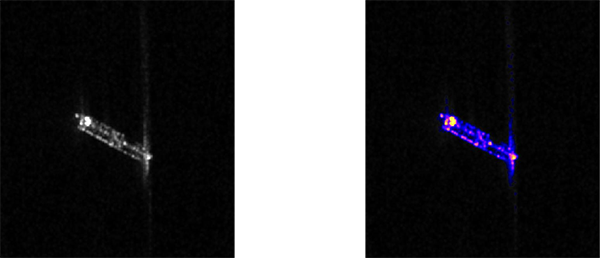
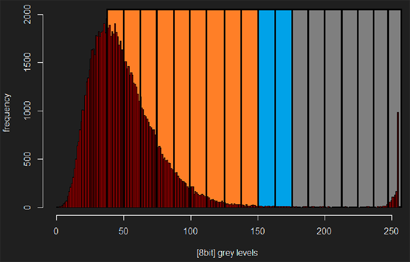

# sar_vessel_adaptive

Adaptive false-color visualization for SAR-based vessel detection image chips.

Reads grayscale 8-bit JPEG chips, separates sea clutter from vessel pixels using a moving-window histogram analysis, and renders vessel pixels in a perceptually optimized color gradient overlaid on the original chip.

<p align="center"></p>

---

## Background

SAR vessel detection products generate image chips: small, centered extracts around each detected vessel. Because SAR imagery varies significantly with sensor parameters, incidence angle, and sea state, no single global radiometric stretching reliably enhances all chips.

Human vision distinguishes colors far more readily than grey levels. A false-color transformation is therefore a meaningful enhancement step: it applies a perceptually optimized gradient to vessel pixels, making them immediately stand out from sea clutter.

---

## Algorithm

The core challenge is deciding where sea clutter ends and vessel pixels begin, as this boundary shifts with every image. `sar_vessel_adaptive.R` locates it adaptively using a moving-window analysis of the chip's pixel histogram.

### Image chip structure

The input is an 8-bit JPEG with 256 grey levels. In a well-stretched chip, the histogram shows a dominant amplitude peak (sea clutter, darker pixels) followed by a tail of brighter vessel pixels. The algorithm locates the transition point between them.

### Parameters

| Parameter | Description |
|---|---|
| `maxPoint()` | Grey level of the histogram peak; start of the analysis span |
| `minPoint()` | Grey level of the histogram minimum after `maxPoint()`; fallback separation point |
| `windowSize` | Moving window width in grey levels; starts at 20, shrinks to 10 in steps of 1 |
| `windowStep` | Fixed step of 5 grey levels between window positions |
| `threshold` | Operator input (0.1–1.0); the fraction of the peak value used as the window sum cutoff |

The search for `maxPoint()` is bounded at grey level 235 rather than 256 for three reasons:
- High-reflectivity targets (ports, rough sea states) produce outliers in the 236–256 range that corrupt the peak detection
- Those grey levels always contain vessel pixels, so no useful analysis is possible there
- Omitting them saves ~5% computation time

### Processing

Starting from `maxPoint()`, a window of width `windowSize` slides rightward by 5 grey levels at a time. At each position, the sum of histogram counts within the window is compared to `threshold x peak value`. When the sum falls below this cutoff, the window position marks the separation boundary: pixels below it are masked, and the remainder are rendered in false color.

If the window reaches the end of the histogram without a result, `windowSize` shrinks by 1 and the scan restarts from `maxPoint()`. If `windowSize` drops below 10, `minPoint()` is used as the fallback separation point (handles very noisy chips or heavy clutter).

<p align="center"></p>

### Color palette

`oceanFireRamp` is a 100-step gradient (blue to cyan to yellow to red) applied to the masked vessel pixels, overlaid on the original greyscale chip.

---

## Prerequisites

- R (>= 3.5)
- R packages: `here`, `sp`, `raster`

Missing packages are installed automatically on first run.

---

## Setup and usage

1. Open `bin/sar_vessel_adaptive.bat` in a text editor
2. Adjust the path to `R.exe` to match your installation:
   ```bat
   "C:\Program Files\R\R-X.X.X\bin\R.exe"
   ```
3. Execute `sar_vessel_adaptive.bat`
4. Enter the full path to the input directory (JPEGs)
5. Enter the full path to the output directory (PNGs)
6. Enter a threshold value between `0.1` and `1.0`

Output PNGs are named after their source files.

---

## Thresholding guide

The threshold controls how aggressively sea clutter is cut from the false-color overlay.

| Threshold | When to use |
|---|---|
| `0.1` | Good chip quality, clear amplitude/tail separation. Default starting point. |
| `0.3` | Moderate clutter or extended tail; safe general-purpose value |
| `0.5`–`1.0` | Heavy sea clutter or poor source stretching; progressively more aggressive masking |

A well-separated chip will show all threshold runs producing very similar separation points. A wide spread between runs signals a difficult chip that benefits from manual threshold tuning.

---

## About

Developed during an internship as part of the [EAGLE MSc program](https://eagle-science.org) at the University of Würzburg.

---